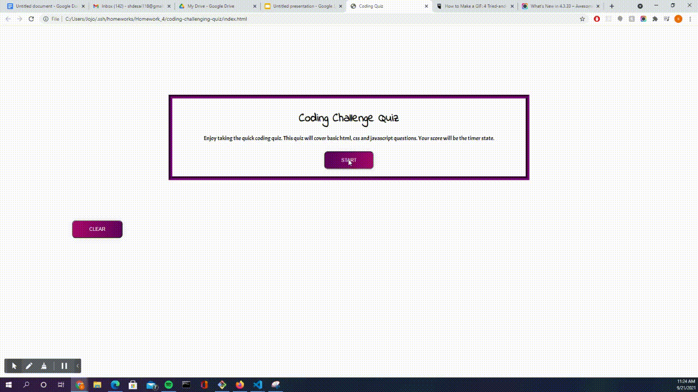

# Coding Challenging Quiz
Created a multiple choice coding quiz


## Description


## Reasoning Behind My Portfolio

* What was my motivation: The motivation of this project was to build a simple coding quiz
* Why did you build this project: The reason behind this project was to improve my skills and understanding regarding event listeners, local storage and modifying html and css using Javascript and 
* What problem does this solve: The project can be expanded to include more questions to help people practice their understanding of basic coding
* What did I learn:  I learned how to dynamically create elements in the HTML from javascript. I am also very comfortable with local storage, event listeners and working in JavaScript from the project.


## Table of Content
- [Webpage](#webpage)
- [Installation](#installation)
- [Code_Breakdown](#code_breakdown)
- [Contact_Information](#contact_infomration)
- [Credits_and_References](#credits_and_references)
- [License](#license)
- [Links](#links)

<br/>

## Webpage





## Installation

* N/A
 

## Code_Breakdown


## Contact_Infomration

```
Email: shdesai118@gmail.com
Cell: 908-883-0191
```

## Credits_and_References

--- 

## License

This project is free use

## Links

