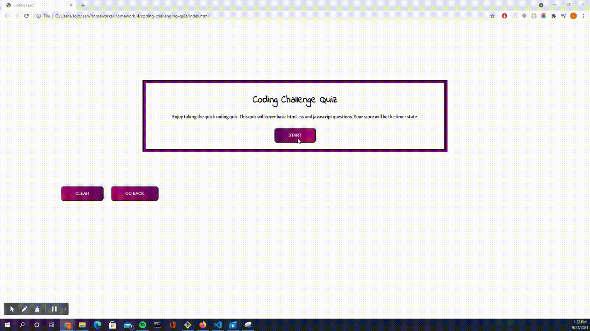

# Coding Challenging Quiz
Created by Siddharth Desai

## Description
The reason for creating this online coding quiz is to help brush up users' coding skills for things such as interview preparation or just to further their own understanding of fullstack. Upon clicking the start quiz the timer will start as the user navigates through the questions. While the user  answers questions correctly or wrong the quiz will show correct in green or wrong in red. The timer will additionally decrement upon each wrong answer. If the timer reaches 0 or if the user answers all the questions the timer will stop and be stored in local storage. An Alert will display and ask for your initials. And your final score will display which will be the final time upon finishing the quiz. Also all the questions you answered incorrectly will display and show what the correct answer was. Finally, all the quiz attempts will also display so you can see your progress. 

This project improved my knowledge and understanding of Javascript and how to manipulate the HTML and CSS via different triggers and processes in Javascript. I feel very confident in my javascript skills after completing this project. Some areas I would like to improve on is CSS and thinking more creatively on how to display content.


## Reasoning Behind My Portfolio

* What was my motivation: The motivation of this project was to build a simple coding quiz
* Why did you build this project: The reason behind this project was to improve my skills and understanding regarding event listeners, local storage and modifying html and css using Javascript and 
* What problem does this solve: The project can be expanded to include more questions to help people practice their understanding of basic coding
* What did I learn:  I learned how to dynamically create elements in the HTML from javascript. I am also very comfortable with local storage, event listeners and working in JavaScript from the project.


## Table of Content
- [Webpage](#webpage)
- [Installation](#installation)
- [Contact_Information](#contact_information)
- [Credits_and_References](#credits_and_references)
- [License](#license)
- [Links](#links)

<br/>

## Webpage





## Installation

* N/A
 

## Code_Breakdown


## Contact_Information

```
Email: shdesai118@gmail.com
Cell: 908-883-0191
```

## Credits_and_References
https://www.w3schools.com/jsref/met_document_getelementbyid.asp
https://www.w3schools.com/jsref/prop_html_id.asp
https://www.w3schools.com/jsref/prop_win_localstorage.asp
https://cssgradient.io/gradient-backgrounds/
https://fonts.google.com/specimen/Indie+Flower?query=flower
https://fonts.google.com/specimen/Acme?query=acme
--- 

## License

This project is free use

## Links
* https://shd118.github.io/coding-challenging-quiz/
* https://github.com/SHD118/coding-challenging-quiz

